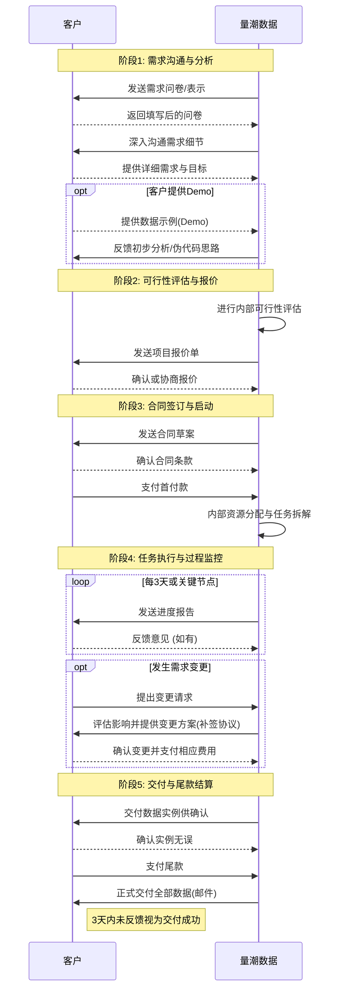

# 量潮数据

## 工作流程

```mermaid
sequenceDiagram
    participant C as 客户
    participant L as 量潮数据

    Note over C, L: 阶段1: 需求沟通与分析
    L->>C: 发送需求问卷/表示
    C-->>L: 返回填写后的问卷
    L->>C: 深入沟通需求细节
    C-->>L: 提供详细需求与目标
    opt 客户提供Demo
        C-->>L: 提供数据示例(Demo)
        L->>C: 反馈初步分析/伪代码思路
    end

    Note over L, C: 阶段2: 可行性评估与报价
    L->>L: 进行内部可行性评估
    L->>C: 发送项目报价单
    C-->>L: 确认或协商报价

    Note over C, L: 阶段3: 合同签订与启动
    L->>C: 发送合同草案
    C-->>L: 确认合同条款
    C->>L: 支付首付款
    L->>L: 内部资源分配与任务拆解

    Note over L, C: 阶段4: 任务执行与过程监控
    loop 每3天或关键节点
        L->>C: 发送进度报告
        C-->>L: 反馈意见 (如有)
    end

    opt 发生需求变更
        C->>L: 提出变更请求
        L->>C: 评估影响并提供变更方案(补签协议)
        C-->>L: 确认变更并支付相应费用
    end

    Note over L, C: 阶段5: 交付与尾款结算
    L->>C: 交付数据实例供确认
    C-->>L: 确认实例无误
    C->>L: 支付尾款
    L->>C: 正式交付全部数据(邮件)
    Note right of C: 3天内未反馈视为交付成功
```